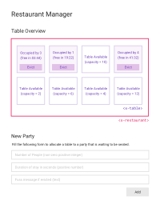

## Vue.js Challenge Task (v1.0)

### 1. Overview

This document describes a task to evaluate your understanding of
component-based design principles in front-end development. It's not a test,
but rather an activity to help a reviewer better understand what aspects of
component-based front-end development you've been exposed to in your career,
so they can identify training requirements.

You're encouraged to complete this task in the same way you work normally, and
to portray your understanding in the most accurate way possible. The reviewer
is well-versed in all aspects of this task and will be able to tell if you
attempt to inflate your understanding. If there's anything you're not
particularly clear on, it's better to share this with the reviewer by leaving
comments in your code.

The task specification below contains several logic gaps and areas of
ambiguity -- this is by design; the reviewer will use these to evaluate ...

1. Your ability to "fill in spec gaps" (i.e. make correct/sensible decisions
when a strong argument can be made about doing things in a certain way).

2. Your ability to recognize spec gaps corresponding to decisions that don't
belong to you (i.e. identify scenarios where it's necessary to seek further
clarity about the task, for example because several viable solutions with
different business-side consequences are available).

The reviewer may ask to schedule a follow-up interview to discuss your
solution and better understand your decisions.

### 2. Task Overview

You're required to design a web page that acts as a basic table management
application for a restaurant, to help its owner manage table occupancy. Here's
a preview of what the page should look like ...



The page should be an interactive Single Page Application (SPA) and should be
developed using Vue.js. There are no API calls to be made and no back end --
all logic should be at the front-end side.

The first subsection "Table Overview" is a sketch of the restaurant, showing
the various tables and their current states (available/occupied). Each table
has a capacity (max number of people it can accommodate), which is shown when
the table is available. If the table is occupied, the table shows the number
of occupants, a countdown timer to availability (in mm:ss format) plus an
evict button to force-evict occupants at any time.

The second subsection "New Party" is a form that's used to allocate an
available table to a new group of people.

You can assume that the restaurant has eight tables with the following
capacities ...

```js
[10, 8, 10, 6, 2, 6, 4, 12]
```

When the page is first loaded, it should initialize the restaurant to a state
where all tables are available. The owner can then start allocating tables to
arriving parties by filling the "New Party" form.

### 3. Architecture

For this exercise, the page is the top-level entity (i.e. the Vue app) while
the restaurant and individual tables are nested components, as shown in the
following tree diagram ...

```
app
└── restaurant
    └── table
```

The restaurant component should be called `<x-restaurant>` while tables should
be instances of a component called `<x-table>`.

The "New Party" form should be part of the app, but not made into a component.

### 4. Requirements

#### Behavioral

The app should behave as follows ...

1. When the "New Party" form is submitted, the first available table of
sufficient but lowest capacity (i.e. minimum capacity, where capacity >= party
size) should be allocated to the party. If no such table is available, an
error message should be displayed using the built-in `alert` function.

2. After the duration of stay expires, the table reverts back to being available.

3. If the "Evict" button is clicked, the party is forced to leave and their
fuss message is displayed using `alert`. The table then reverts to being
available.

#### Technical

The delivered solution must also satisfy the following technical requirements
...

1. `<x-table>` should expose an async function `untilAvailable` that can be
`await`ed until the table becomes available. For example ...

```js
await table1.untilAvailable()
```

2. `<x-restaurant>` should expose an async function `awaitTable` that can be
`await`ed until a table that can accommodate `n` people becomes available. For
example ...

```js
const table = await restaurant.awaitTable(4);  // await availability of table of size 4+
```

3. `<x-restaurant>` should expose a function `save(key)` that will save the
restaurant's state under the key `key` using the localStorage API, and a
corresponding function `load(key)` to load saved states.

### 5. Evaluation Criteria

Remember, the main objective of the task is to test your architectural skills
and understanding of component-based design. This is a front-end development
task but the reviewer will **NOT** consider the following:

1. UX
2. Styling
3. Validation
4. Accessibility

Instead, here are the things the reviewer will look for, ordered by importance
...

#### 1. Separation of Concerns

The reviewer will examine where you draw the line between the responsibilities
of the various components. For example, they will look at where you define
data items in the hierarchy and how you pass them in and out of components.
They will consider which component you thought should be responsible for
housing each data item (e.g. table occupancy), and for performing certain
functions (e.g. table eviction).

#### 2. Vue.js Guidelines and Practices

The reviewer will consider to what extent does your solution adhere to
official Vue.js guidelines, community recommendations, best practices and
popular programming patterns.

#### 3. Modern ES6 Standards

The reviewer will consider your familiarity with the more recent features of
JavaScript (specifically, they will penalize pre-ES6 programming patterns and
award points for cutting-edge patterns with good browser support).

#### 4. Reusability

The reviewer will consider to what extent have you made your components
general-purpose (while remaining within the boundaries of what's required in
this task).

#### 5. Semantic Programming

The reviewer will consider your code's readability. They will award points for
programming patterns that make your code friendly to humans (e.g.
concise/descriptive variable/function naming) and penalize ambiguous or
unnecessarily-long patterns, as well as any "clever" attempts to over-optimize
or solve non-issues at the expense of readability.

### 6. Starting Template

The template `template/index.htm` should be used as a starting point.

The expected deliverable is a **single HTML file** (based on the above
template) containing a full implementation (app and components), including all
the necessary HTML, JS and CSS (in a single file). You can submit it as a pull
request to this repo.

You're not allowed to use any external dependencies (JS, CSS or else) other
than what's already included in `template/index.htm`, unless there is a
compelling reason that's preventing you from completing the task (e.g. browser
support).
# Restaurant-management-vue
# Restaurant-management-vue
